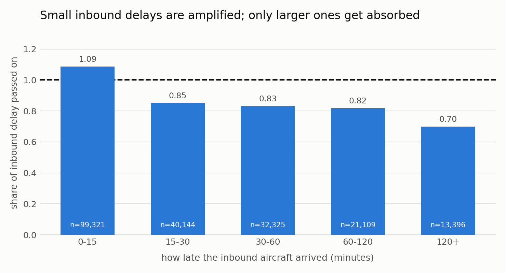
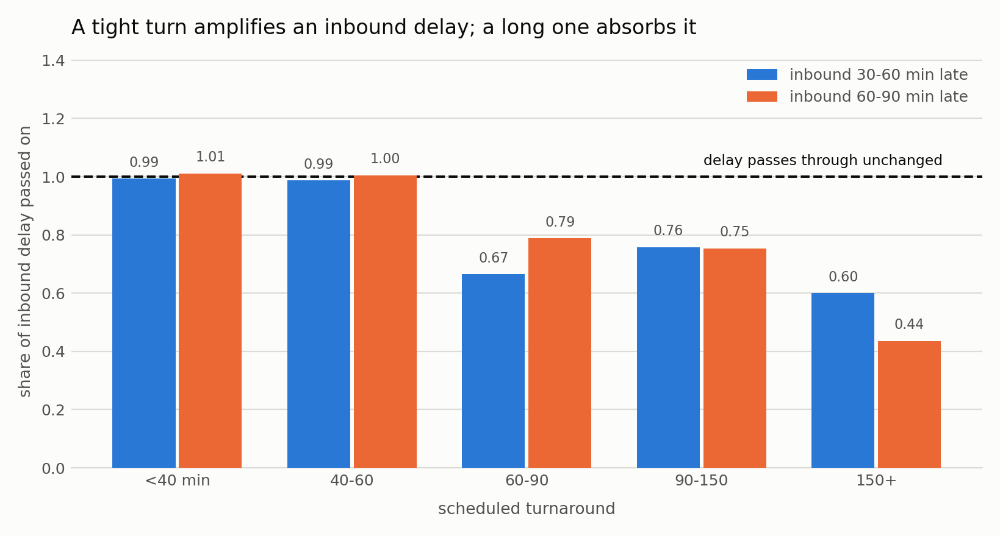
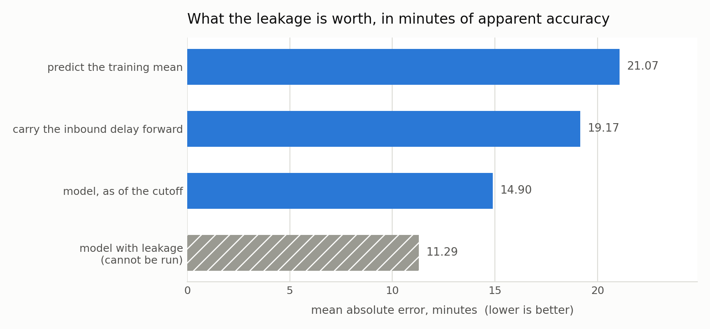

# Delay propagation through aircraft rotations

[](https://github.com/JAYANSHUBADLANI/flight-delay-propagation/actions/workflows/pytest.yml)

An aircraft flies four or five legs in a day. When it arrives late, some of that
lateness reaches its next departure and some of it does not. This measures how
much, on the US Bureau of Transportation Statistics On-Time Performance file,
and finds what decides the difference.

I built it because almost every public analysis of this dataset asks the same
question, predict whether a flight will be delayed, and the operationally
interesting question is a different one: **once a delay exists, what happens to
it next?**

## The headline, and the thing that spoiled it

The obvious summary is a *passthrough ratio*: of the minutes an aircraft arrived
late, what share survives into its next departure. Measured that way, scheduled
turnaround time decides most of it. A turn under an hour passes delay on almost
untouched; a turn over two and a half hours gives back half or more.

That much held up. What did not was the first version of it, and the reason is
worth more than the result:

> **My first run said a tight turn *amplifies* delay, passthrough 1.23, rising
> to 1.83 on small delays, and that it adds a fixed penalty of 7 to 10 minutes
> whatever arrives. Both of those findings were an artifact of a bug I had put
> in myself, and neither survived fixing it.**
>
> BTS timestamps every leg in the **local time of its own airport**. I had
> treated any leg whose arrival clock read earlier than its departure clock as
> landing the next day, and added 1,440 minutes. But ATL to HSV leaves at 08:25
> Eastern and lands at 08:24 Central after 59 minutes in the air. Nothing
> crosses midnight. In January 2024 that rule shifted **2,575 legs by a
> spurious day** and simultaneously missed about **8,800 genuine overnights**,
> wrecking exactly the turnaround arithmetic the whole analysis rests on.
>
> The fix is to stop reading the arrival clock and use scheduled elapsed time,
> which is timezone-free. Corrected, a tight turn is **neutral**, not
> amplifying: it passes delay through at 0.99 to 1.01 and adds essentially
> nothing of its own.

I found it because a downstream model returned a plan worse than doing nothing,
which is impossible if the model is right. Chasing that produced a leg that
appeared to arrive at minute 1,941 of the day. Both retired findings are still
described above rather than quietly deleted, because the corrected result is
only worth as much as the account of how it was got.

Everything here comes from running the pipeline. No number in this README was
typed in by hand; each one is in `reports/`.

## The data

**Reporting Carrier On-Time Performance (1987-present)**, published by the
Bureau of Transportation Statistics, US Department of Transportation. One row per
domestic flight leg, 109 columns, going back to 1987 and running to roughly two
months behind the present.

Files are served as plain zips over HTTPS with no account, key or scraping
involved, so the data step in this repo is genuinely reproducible:

```
https://transtats.bts.gov/PREZIP/On_Time_Reporting_Carrier_On_Time_Performance_1987_present_{YEAR}_{MONTH}.zip
```

The month carries **no leading zero**: `2024_1`, not `2024_01`. To browse rather
than script it, the field-selection page is
[DL_SelectFields.aspx](https://www.transtats.bts.gov/DL_SelectFields.aspx?gnoyr_VQ=FGJ&QO_fu146_anzr=b0-gvzr)
and the table index is
[Tables.asp](https://www.transtats.bts.gov/Tables.asp?QO_VQ=EFD&QO_anzr=Nv&QO_fu146_anzr=b0-gvzr).

### What this analysis ran on

| | rows | as CSV | used for |
|---|---:|---:|---|
| January 2024 | 547,271 | 235 MB | absorption; prediction training |
| February 2024 | 519,221 | 224 MB | out-of-time test only |

January alone covers 15 reporting carriers, 334 origin airports and 5,604
distinct tail numbers. Neither file is committed, see [data/README.md](data/README.md) for the
download step and for why 2024 rather than 2020 or 2021.

### The columns that carry this project

Twenty of the 109 are read, listed in `src/config.py`. Three of them are the
reason the project is possible at all:

- **`Tail_Number`**: without it there are no rotations and no propagation to
  measure. It is the whole premise.
- **`CRSDepTime` / `DepDelay` / `CRSArrTime` / `ArrDelay`**: scheduled against
  actual, at both ends of every leg, which is what makes a turnaround measurable.
- **`LateAircraftDelay`**: the airline's own attribution of delay to a late
  inbound aircraft. The carriers are already telling you propagation is real;
  this repo measures how much of it the schedule absorbs.

**What is not in the file:** crew assignments and passenger counts. Neither is
published. That is why every objective here is in flight-minutes rather than
passenger-minutes, and why the recovery model in *Next* will be aircraft-rotation
recovery only.

## Rebuilding the rotations

Everything depends on chains being right, so this is checked before anything is
concluded from them.

| | January + February 2024 |
|---|---|
| legs after dropping cancelled, diverted and missing-tail rows | 1,040,639 |
| aircraft-days | 273,103 |
| mean legs per aircraft-day | 4.54 |
| legs with a predecessor | 767,536 |
| **predecessor's destination equals this leg's origin** | **98.93%** |
| usable turns after the buffer sanity filter | 624,258 |
| median scheduled turnaround | 62 min |
| legs landing after midnight | 3.91% |

Those figures are in `reports/chain_quality.json`. 98.93% continuity means the
tail number really does reconstruct the rotation; the remaining 1.1% are tail
swaps, ferry and maintenance movements, and same-tail reassignments that a
public file cannot distinguish. Two details quietly decide whether any of this
works: BTS writes midnight as `2400`, which sorts after every other departure
and silently reverses a rotation if left alone, and arrival times must come from
elapsed time rather than the published clock, for the timezone reason above.
Both are handled in `src/rotations.py` and both have tests.

## Correcting the baseline first

A leg departs 0.45 minutes late on average *even when its aircraft arrived
early*, because boarding, gate and crew produce delay of their own. That has
nothing to do with propagation, and every ratio here nets it out before dividing.
Uncorrected it inflates every bucket, and inflates the small ones most.



Bucket counts and both the raw and corrected ratios are in
`reports/absorption_by_inbound_delay.json`.

## Scheduled buffer is the mechanism



Holding inbound delay inside a narrow band, where the mean agrees to about a
minute across every turn bucket, the split is between turns under and over an
hour, not a smooth gradient:

| scheduled turn | inbound 30-60 late | inbound 60-90 late |
|---|---:|---:|
| < 40 min | 0.99 | 1.01 |
| 40-60 | 0.99 | 1.00 |
| 60-90 | 0.67 | 0.79 |
| 90-150 | 0.76 | 0.75 |
| 150+ | 0.60 | 0.44 |

Anything under an hour is a pipe: delay goes in and the same delay comes out.
Past an hour the schedule starts giving time back, reaching 56% absorbed on the
longest turns against a 60 to 90 minute inbound delay. It is **not monotone**,
90-150 absorbs slightly less than 60-90 in the first band, and with 5,356 and
7,929 legs behind those two cells that gap is small enough that I would not
build an argument on the ordering, only on the break at one hour.

The first version of this comparison was confounded: the longest-turn bucket sat
on a mean inbound delay far above the shortest, so part of what looked like
buffer was the delay-size effect from the previous figure. Both bands are in
`reports/absorption_by_buffer_controlled.json`, and the original confounded
version is kept in `reports/absorption_by_buffer.json` rather than deleted, so
the correction can be checked.

## The additive view

Minutes of departure delay added *on top of* the inbound delay itself, after the
baseline correction, from `reports/additive_penalty.json`. Negative means the
turn gave time back.

| scheduled turn | inbound 0-15 | 15-30 | 30-60 | 60-120 | 120+ |
|---|---:|---:|---:|---:|---:|
| **< 40 min** | +2.8 | −0.0 | −0.4 | +2.4 | +2.0 |
| **40-60** | +0.4 | −1.3 | −0.5 | +0.8 | +3.1 |
| **60-90** | −2.9 | −8.8 | −14.3 | −15.3 | −21.2 |
| **90-150** | +0.5 | −4.5 | −10.4 | −20.1 | −28.4 |
| **150+** | +2.2 | −3.7 | −17.5 | −52.7 | −162.5 |

The top two rows are flat and near zero: a short turn neither absorbs nor adds,
across a delay range spanning twentyfold. The bottom rows grow with the delay,
which is what a buffer does: it can only give back time it was holding.

This table is also where the retired finding is easiest to see. Before the
timezone fix the top row read +6.5 to +13.7 and looked like a real mechanism.

## Predicting the next departure, without cheating

The second part asks whether the delay can be called *before* it happens, and the
whole difficulty is one number:

> **Two hours before a scheduled departure, the inbound aircraft has already
> landed in only 22.8% of cases.**

For the other 77% its arrival delay does not exist yet. It is the first feature
anyone reaches for, it is sitting right there in the file, and it is not
available at the moment a prediction would be useful. So every feature is stamped
with a cutoff two hours before scheduled departure, and a fact about the inbound
leg enters only if it had already happened by then. Where it had not, the feature
is left **missing rather than filled**, which is itself signal: it says the
aircraft was still out. Its *departure* is a different story, that is known 85.4%
of the time, and it is most of what the honest model runs on.

Trained on January 2024 (312,418 chained legs) and tested **out of time on
February** (311,840), predicting departure delay in minutes:

| | MAE | RMSE |
|---|---:|---:|
| predict the training mean | 21.07 | 37.55 |
| carry the inbound delay forward (the rule ops would use) | 19.17 | 37.75 |
| **model, as of the cutoff** | **14.90** | **33.53** |
| model, with leakage | 11.29 | 29.62 |

A within-January split (train 1-24, test 25-31) gives 22.85 / 20.70 / **16.05** /
12.10 on the same four rows, so the model loses nothing crossing into a month it
has never seen. Both are in `reports/prediction_metrics.json`.



**The obvious operational rule barely beats guessing the mean**, 19.17 against
21.07, because it has nothing to carry forward more than three quarters of the
time and falls back to the mean anyway.

**The honest model cuts MAE by 29%** against that mean baseline.

**And the leaky model looks 24% better than the honest one can ever be.** That
last row is the point of the exercise. It is trained identically except that it
receives the true inbound arrival delay unconditionally, the way a
straightforward `merge` on the previous leg would hand it over. It reports MAE
11.29 and cannot be run two hours ahead, because most of the time its best
feature has not happened yet. The gap between 11.29 and 14.90 is the size of the
mistake, and it is why the cutoff is enforced in code and covered by tests
(`tests/test_features.py`) rather than left as an intention.

## Recovering a disrupted rotation

The third part is the decision the first two set up. An aircraft is held on the
ground at a hub; the legs it was due to fly are at risk, and so are the legs of
every aircraft it could be swapped with. Hold, swap, or cancel?

That is a mixed integer program, solved with HiGHS through `scipy.optimize.milp`.
Each leg is a task, a binary variable turns on when one leg is flown immediately
after another by the same aircraft, and a continuous variable carries each leg's
departure delay forward along whichever connections the solver switches on. The
objective is total delay-minutes plus a penalty per cancellation and a smaller
one per swap.

Four real hubs, each with its most exposed aircraft held for 60, 120 and 180
minutes, from `reports/recovery_scenarios.json`:

| scenario | legs | disruption | do nothing | recovered | swaps | cancels |
|---|---:|---:|---:|---:|---:|---:|
| UA / ORD | 36 | 60 | 93 | 93 | 0 | 0 |
| | | 120 | 319 | 185 | 12 | 1 |
| | | 180 | 641 | 185 | 12 | 1 |
| AA / DFW | 46 | 60 | 93 | 21 | 10 | 0 |
| | | 120 | 213 | 116 | 15 | 0 |
| | | 180 | 360 | 152 | 19 | 0 |

**A 60-minute disruption often needs no recovery at all.** In three of the four
hubs the optimiser cannot beat doing nothing at that size, because the schedule's
own buffer already absorbs it, which is the first half of this repo restated as
a decision. Recovery earns its keep from about two hours.

**Read the cancellation column before the delay column.** Where a plan cancels a
leg, the delay saving is not like-for-like: the do-nothing baseline cancels
nothing, so some of the improvement is a flight that no longer exists rather than
a delay that no longer happens. The scenarios above are reported with both.

Three modelling choices are load-bearing and none of them is obvious:

- **Connections must run strictly forward in time.** Without it the formulation
  admits subtours, a closed loop of legs satisfying every constraint while being
  flown by no aircraft at all, so those legs vanish from the plan and the
  reported delay is too low. Six legs disappeared this way in the first working
  version. It is now a test.
- **A scheduled turn tighter than the model's minimum is still feasible.** Ten
  percent of real turns are under 40 minutes. A minimum turn constrains
  connections a plan would newly create; it is not a licence to overrule the
  published schedule, and applying it to a leg's own succession invents delay on
  aircraft that were never disrupted.
- **Swaps are not free.** Priced at zero the solver permutes interchangeable
  aircraft and reports the permutation as a recommendation.

## Limitations

These are real and they bound what the numbers above can be used for.

- **Two winter months.** Everything is January and February 2024, which is a
  genuine out-of-time test but not a seasonal one. Summer operations are
  congestion- and thunderstorm-driven rather than snow-driven, and nothing here
  says any of this holds there. `make data-full` fetches the year for that check.
- **Rotations are cut at the calendar day.** BTS keys rows by flight date, and an
  aircraft flying past midnight continues the next morning. The overnight gap is
  long enough that delay does not survive it, so a same-day chain is defensible,
  but it is a choice and not a fact.
- **Cancelled legs are dropped, and that is not neutral.** A cancellation is
  itself a response to disruption, so what remains is conditioned on the airline
  having chosen to fly. Absorption measured on flown legs is therefore optimistic.
- **The absorption results are correlational.** Airlines choose their turnaround
  buffers. A station or route that gets 90 minutes may be one that is inherently
  easier to turn, so the buffer gradient is not a clean causal estimate of what
  adding buffer would do.
- **Each recovery scenario covers part of a day, not all of it.** Where a tail's
  recorded chain breaks, the scenario keeps only its longest connected run, so a
  scenario is a slice of the operation rather than the whole hub.
- **No crew, no passengers, no gates, no slots, no maintenance.** None of it is in
  the public file. So the objective is flight delay-minutes rather than passenger
  delay-minutes, "can this tail fly this leg" is approximated by same-carrier
  rather than by fleet compatibility, and the result is an **aircraft-rotation
  recovery, not an airline operations recovery**. Treated as more than that it
  would be wrong.

## Running it

```bash
pip install -r requirements-dev.txt
make test                                 # 40 tests, needs no data at all
make data                                 # Jan + Feb 2024, ~10 min, ~460 MB
make absorption                           # writes reports/*.json
make predict                              # trains the model, writes metrics
make recover                              # solves the recovery MILP
make figures                              # writes reports/figures/*.png
make test
```

`make all` reproduces every number in this README from scratch. `make data`
fetches only the two months the analysis used; `make data-full` fetches all of
2024, which takes roughly fifty minutes and 2.8 GB. Source files are not
committed; see [data/README.md](data/README.md) for where they come from and why
2024.

## Next

The full year, which is the seasonal check the two-month result cannot give, and
a recovery objective weighted by seats rather than flights. BTS T-100 publishes
passengers and seats by carrier, route and month, which is a defensible proxy
where per-flight passenger counts do not exist.
